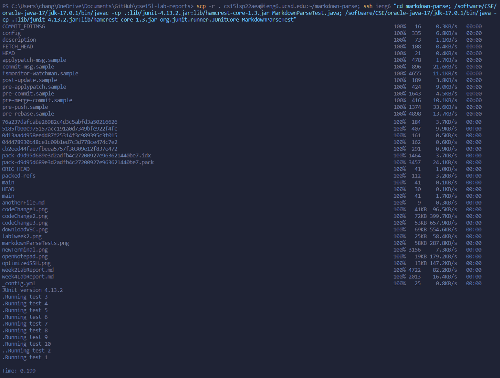

# Week 4 Lab Report

> Due May 8, 2022 <br>
**Topic:** Lab 5 Challenges

---

## Streamlining `ssh` Configuration

* Normally when you call `ssh`, you also have to tell it your username, along with the server host. However, by streamlining this process, you'll be able to connect to server hosts without the need of typing your username.

* To do this, we first need to find our local ssh directory

    

* Once you find it, you should see a `config` file.

    > If you don't have one, you can just create one

* Once you found it, open it up using any text editor. In my case, I will be using Notepad.

    

* After that, just type in the server host and your username in the following format:

    ```Java
    Host <host>
        HostName <host_name>
        User <username>
    ```

* As an example, this is what mine looks like:

    

* That's it. You're done.

* Now, when you want to connect to the server, you can just type `ssh <host>`, and it'll automatically connect you without requiring you to type your username like so:

    

* Now that we've streamlined our ssh process, let's practice copying a file over to our server account by using `scp`

* As an example, I can run this command below to copy a file named `index.md` to my remote `ieng6` account

```powershell
    scp index.md ieng6:/home/linux/ieng6/cs15lsp22/cs15lsp22aea
```


&nbsp;
## Setup Github Access from ieng6

* If you've used git commands on server accounts, you may have noticed by now that you can't use `git commit` and `git push`. This is because github requires token authentication when using these commands.

* However, if we set up ssh keys between our remote account and github, we'll be able to call these commands easily.

* To start this process, we first need to create an ssh key on our remote account like so using the command `ssh-keygen`


&nbsp;
## Copy whole directories with `scp -r`

* It's important to learn how to copy directories from your local computer to a remote account. For this tutorial specifically, I will copying a directory over to my `ieng6` account and compiling the tests inside it.

* The first step is to copy a directory remotely by running said command:
    > `scp -r . cs15lsp22<user>@ieng6.ucsd.edu:~/markdown-parse`

* What this does, is it copys everything in my current directory, represented by the "`.`", to my remote `ieng6` account.

* This is an example of what it looks like:

    

* After that, I can `ssh` onto my remote account and run the tests inside like so:

    

    > Keep in mind that I had a `makefile` inside, which allowed me to call `make test` in order to compile and run the tests

* Now we know how to both copy and compile a directory, let's try doing it all in one line!

    ```t
        scp -r . cs15lsp22aea@ieng6.ucsd.edu:~/markdown-parse; ssh ieng6 "cd markdown-parse; /software/CSE/oracle-java-17/jdk-17.0.1/bin/javac -cp .:lib/junit-4.13.2.jar:lib/hamcrest-core-1.3.jar MarkdownParseTest.java; /software/CSE/oracle-java-17/jdk-17.0.1/bin/java -cp .:lib/junit-4.13.2.jar:lib/hamcrest-core-1.3.jar org.junit.runner.JUnitCore MarkdownParseTest"
    ```

    > Just make sure to use your username in place of mine

 * Here's an example of what it looks like:
 
    