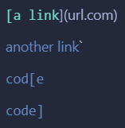
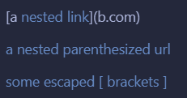
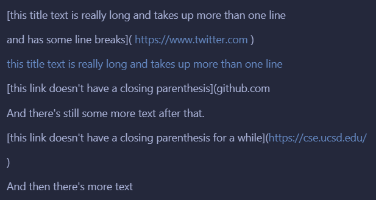
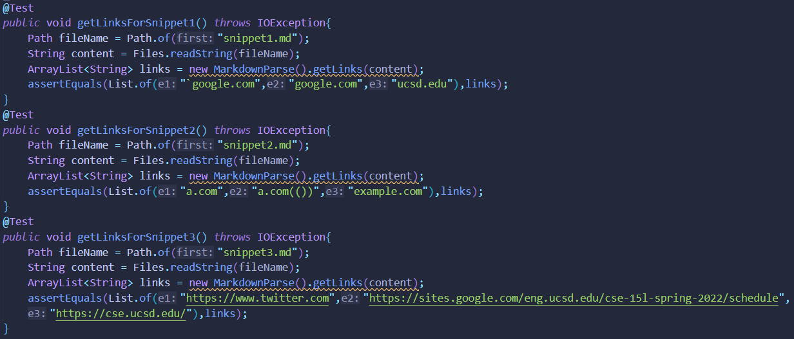
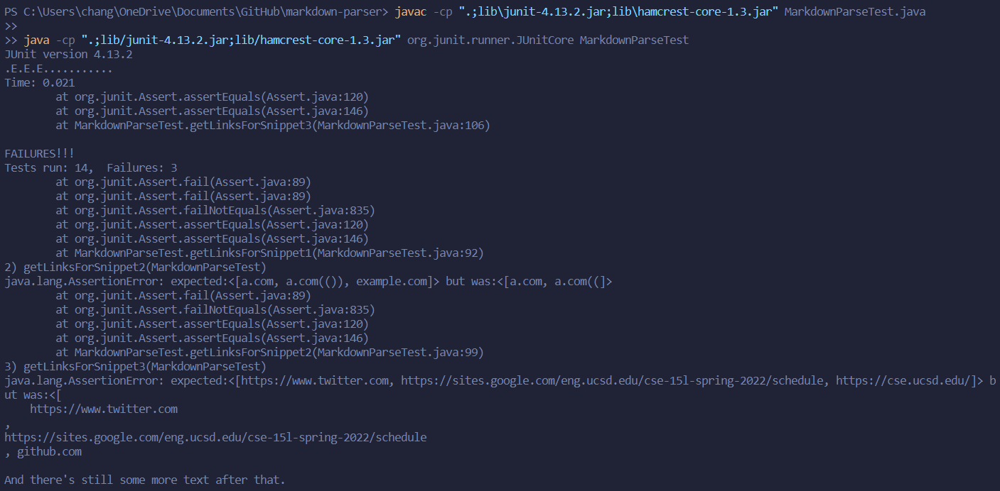
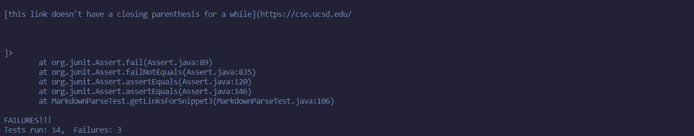
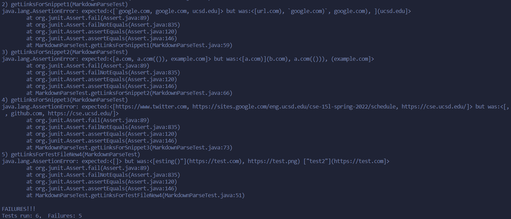

# Week 8 Lab Report

> Due May 22, 2022  
**Topic:** Markdown Parser Tests

---
## **Expected Links**:

> All expected links will be according to VS Code's preview

- **Snippet 1**:
    
    

- **Snippet 2**:
    
    

- **Snippet 3**:
    
    

## **My Implementation:**

- [Link to my **Markdown Parser**](https://github.com/dfchang149/markdown-parser)

- These are the tests I added for the snippets:

    

- Output:

    
    

- As you can see, my implementation of markdown parse currently fails all 3 tests for the snippets.

- ## **Questions:**
    
    **1)** Is there a small code change (<10 lines) I could make to fix similar cases to `snippet 1`?

    > I think it would be a more involved change to get my program to work with cases that use inline code with backticks. If I had to implement a fix for it, I would probably need to check the square brackets and paretheses to make sure they weren't actually inline code, meaning they weren't surrounded by backticks. Something like that would definitely take more than 10 lines of code.
    
    **2)** Is there a small code change (<10 lines) I could make to fix similar cases to `snippet 2`?

    > I feel fixing snippet 2 would also be a more involved change. Not only would I have to keep track of the number of starting and ending brackets/parentheses, but I would likely have to match them up in order to see whether they were nested or not. This type of fix would take more than 10 lines to implement.
    
    **3)** Is there a small code change (<10 lines) I could make to fix similar cases to `snippet 3`?

    > For snippet 3, I believe I fix it under 10 lines. I think I would just need to trim the links so that they don't include new lines or `\n`. After that, if there happened to be another starting bracket before the end parenthesis, then the link won't be retrieved (ex: "github.com"). 

## **Another Implementation:**

- [Link to their **Markdown Parser**](https://github.com/KristinEbu/markdown-parser)

- I copied over the snippet tests from my Markdown Parser so the tests are just the same:

    

- Output:

    

- As seen, their implementation of Markdown Parse also fails all 3 snippet tests