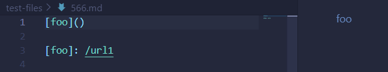

# Week 10 Lab Report

> Due June 5th, 2022  
**Topic:** More Markdown Parser Testing

---
## **Intro**

Before I go over the test files I will be testing and comparing, I want to explain how I found them.

To start, I manually skipped around the test files in `markdown-parser/test-files` to specifically find those with links and brackets.

This is because I knew that if there were no brackets or parenthesis of any sort, both my implementation and the one provided by lab 9 would fail to retrieve the urls.

Thus, I searched randomly and manually, until I came across test files 566 and 567, both of which I tested in order to discover that it yielded different results for both implementations. 

## **Expected Links**:

> All expected links will be according to VS Code's preview

- **Test file [566](https://github.com/nidhidhamnani/markdown-parser/blob/main/test-files/566.md)**:

    

- **Test file [567](https://github.com/nidhidhamnani/markdown-parser/blob/main/test-files/567.md)**:
    
    

## **My Implementation:**

- These are the tests I added for tests 566 and 567:

    

- Output:

    

- As you can see, my current implementation fails both tests.

## **Lab 9's Implementation:**

- I copied over the tests from my Markdown Parser through Vim, so the tests are just the same:

    

- Output:

    

- As it seems, their implementation also fails for test 567, however, it seems to have passed test 566

## **Conclusion**

- From what I can tell, only Lab 9's implementation for test file 566 was correct. The expected output was a link with an empty string or `""`. However, it seemed my implemention returned no links at all.

- Meanwhile, neither implementations passed test 567, with both having different outputs.

    - My implementation retrieved `"not a link"` as a link, and their implementation didn't even get any links.

    - The expected result, however, was `"/url"`, according to VScode

