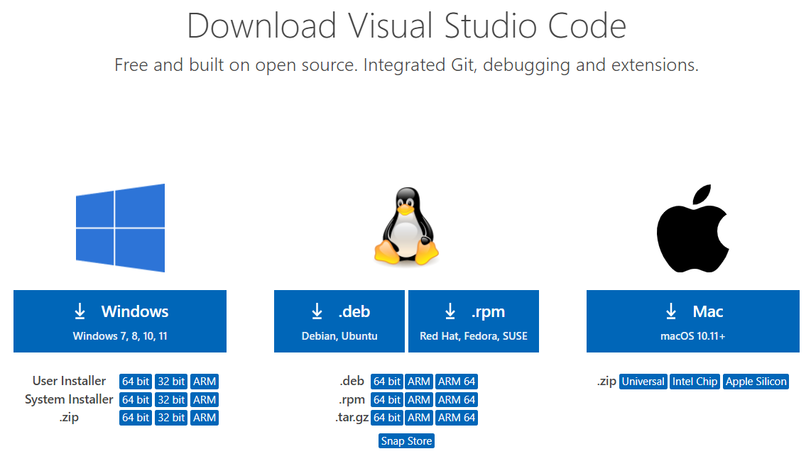
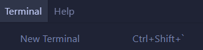
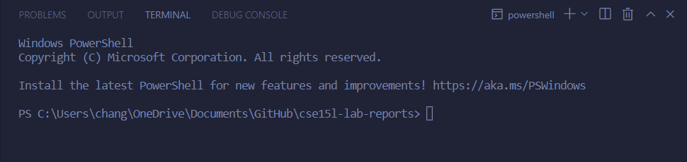
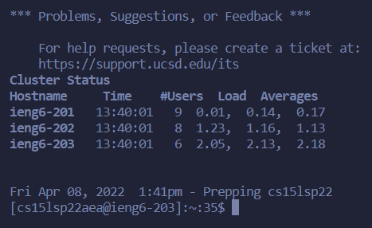
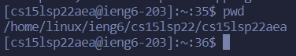

# Week 2 Lab Report

> Due April 10, 2022

> **Topic:** Remote Accessing

---
## **Steps:**

### 1: Installing `VScode`

* Before we can even remotely access your course-specific accounts, we need to download [VScode](https://code.visualstudio.com/download)
* When you get to the download page, you should download the installer meant for your operating system (Likely Windows)

    

---
### 2: Remotely Connecting

* Now that we've installed VScode, we need to open it up and create a new terminal through the top bar

    

* After creating a new terminal, you should see this pop up:

     
    > This is where you'll run your commands in order to remote access

* Now, to actually start the process, we'll need to use the `ssh` command.
    - This will allow us to connect to the ieng6 server for our courses
    
    - > We'll run the command by typing:
    `ssh cs15lsp22<username>@ieng6.ucsd.edu`
    
    > **Important:** Make sure to replace `<username>` with your actual course username.

* After you run the command successfully, it'll ask you for your password, so just type in your course-specific password.
    
    - > Keep in mind that it won't show any indication of your input as you type (for the purpose of being secure); however, that doesn't mean you're not typing anything.

    - > It might also ask for your password several times as well, so just keep retyping your password until it works.

* Once you've successfully connected to the server through `ssh`, you should see something similar to this:

     
    > This means we can now run commands through the `server`!

---
### 3: Trying Some Commands

* Now that we've successfully accessed the server through a remote `ssh` connection, there are some commands we can run.

* One such command is `pwd`, which prints out your current working directory:

    

    For instance, it tells me that my current working directory is `/home/linux/ieng6/cse15lsp22/sp15lsp22aea`

    > Here is a [list](http://mally.stanford.edu/~sr/computing/basic-unix.html) of commands you can try out for yourself

---
### 4: Moving Files with `scp`

---
### 5: Setting up an `SSH key`

---
### 6: Optimizing Remote Running
