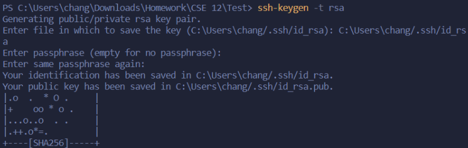
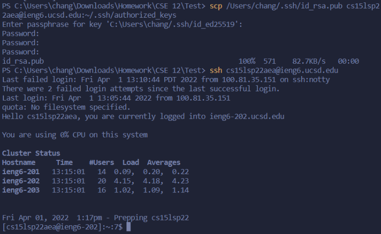

# Week 2 Lab Report

> Due April 10, 2022  
**Topic:** Remote Accessing

---
# **Steps:**

## **1)** Installing VScode

* Before we can remotely access your course-specific accounts, we need to download [VScode](https://code.visualstudio.com/download)
* When you get to the download page, you should download the installer meant for your operating system (Likely Windows)

    

&nbsp;
## **2)** Remotely Connecting

* Now that we've installed VScode, we need to open it up and create a new terminal through the top bar

    

* After creating a new terminal, you should see this pop up:

     
    > This is where you'll run your commands in order to remote access

* Now, to actually start the process, we'll need to use the `ssh` command.
    This will allow us to connect to the ieng6 server for our courses. We'll run the command by typing:
    `ssh cs15lsp22<username>@ieng6.ucsd.edu`
    
    > **Important:** Make sure to replace `<username>` with your actual course username.

* After you run the command successfully, it'll ask you for your password, so just type in your course-specific password.
    
    > Be aware that it won't show any indication of your input as you type; however, that doesn't mean you're not typing anything.

    > It might also ask for your password several times as well, so just keep retyping your password until it works.

* Once you've successfully connected to the server through `ssh`, you should see something similar to this:

     
    > This means we can now run commands through the `server`!

&nbsp;
## **3)** Trying Some Commands

* Now that we've successfully accessed the server through a remote `ssh` connection, there are some commands we can run.

* For example, there's a command called `pwd`, which prints out your current working directory:

    

    For instance, it tells me that my current working directory is `/home/linux/ieng6/cse15lsp22/sp15lsp22aea`
    
    > Here is a [list](http://mally.stanford.edu/~sr/computing/basic-unix.html) of commands you can try out for yourself

&nbsp;
## **4)** Moving Files with `scp`

* Having tried some commands on your own, it's time to learn how to copy files between the server and your local computer

    > The command syntax is as followed:   `scp [option] <filename> <location>`

    For now, you don't need to worry about `[option]`

* Here's an example of copying a file called `WhereAmI.txt` to the server from my local computer 

    

    > Keep in mind, this command was ran from my **local computer** not the server

&nbsp;
## **5)** Setting up an `SSH key`

### Part 1:

* You might have noticed that you are asked for a password everytime you remotely access the server. This can be tedious, hence we have a solution, which is to create an `SSH key`
* By creating a key on your local computer and copying it over to the server, you'll be able have remote access without the need of typing in your password every single time

    > For this step, we'll only **create** the `SSH key`

* To do this, we first run the command `ssh-keygen -t rsa` to create our `ssh key` on our local computer

* After that, it'll ask for a passphrase, however, you can just press **Enter** twice to leave it empty.

* Once you've created the key, a small ascii image will appear:

    

### Part 2:

* Now that we've created the key, we just need to copy it over to the server in order to make remote accessing much easier 

* We can do that by running the `scp` command and copying it over to `cs15lsp22<username>@ieng6.ucsd.edu~/.ssh/authorized_keys`

* Finally, we can now run the `ssh` command one last time, and if everything has been done correctly, you'll no longer be asked for your password.

    Here's an example:

    

    > Notice how it doesn't ask for the password after running `ssh`

&nbsp;
## **6)** Optimizing Remote Running

* Now that we've set up our `ssh key`, we can easily save time when running commands through the server

* For example, we can run a command on the server and exit right after an `ssh` command by surrounding the command in quotes like so:
    
    

    > Notice how I'm still on my local computer after running the command `ls` on the server.

&nbsp;
# The End
You now know how to remotely access your course-specific accounts through VScode. Congrats!

